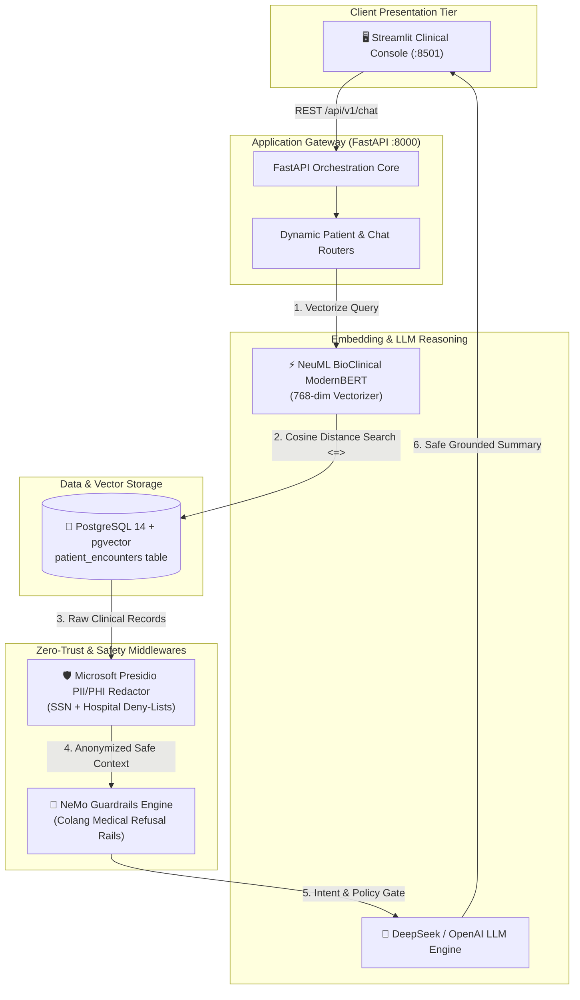

# 🏥 Zero-Trust Clinical EHR Decision Support Platform

[](https://python.org)
[](https://fastapi.tiangolo.com)
[](https://streamlit.io)
[](https://github.com/pgvector/pgvector)
[](https://huggingface.co/NeuML/bioclinical-modernbert-base-embeddings)
[](https://github.com/microsoft/presidio)
[](https://github.com/NVIDIA/NeMo-Guardrails)
[](https://docker.com)
[](LICENSE)

An enterprise-grade, zero-trust clinical Retrieval-Augmented Generation (RAG) platform designed to enable physicians and healthcare specialists to query longitudinal electronic health records (**MIMIC-IV** transcripts) in natural language while maintaining uncompromising HIPAA compliance, strict PII redaction, and deterministic medical safety guardrails.

---

## 🏛️ System Architecture



---

## ✨ Key Enterprise Capabilities

- **Zero-Trust PHI De-Identification**: Automated scrub of Protected Health Information (SSNs, dates, phone numbers, physician identities, healthcare institutions) using Microsoft Presidio and customized pattern recognizers before any prompt leaves the internal network.
- **pgvector High-Dimensional Semantic Retrieval**: Native PostgreSQL vector search utilizing 768-dimensional embeddings generated by `NeuML/bioclinical-modernbert-base-embeddings` over MIMIC-IV clinical encounter transcripts.
- **NeMo Safety Guardrails & Colang Flows**: Deterministic boundary enforcement intercepting unauthorized requests for prescriptive medical advice or drug alteration, keeping the system compliant with diagnostic liability standards.
- **Asynchronous Microservices**: Decoupled FastAPI backend and Streamlit clinical front-end optimized for multi-process containerized execution.
- **Automated CI/CD & Docker Orchestration**: One-click containerization with internal microservice communication and automated GitHub Actions EC2 deployment over SSH.

---

## 🚀 Quickstart Guide

### 1. Prerequisites
- Python 3.12+
- PostgreSQL 14+ with `pgvector` extension
- Docker & Docker Compose (optional for containerized run)

### 2. Environment Configuration
```bash
git clone git@github.com:superezzdev/coldchain-ai.git clinical-ehr-rag
cd clinical-ehr-rag

cp .env.example .env
```

Populate `.env` with your PostgreSQL database credentials and DeepSeek/OpenAI API key:
```env
DB_HOST=localhost
DB_PORT=5432
DB_NAME=ehr_db
DB_USER=ehr_admin
DB_PASSWORD=SecureClinical2026!
OPENAI_API_KEY=your_api_key_here
OPENAI_BASE_URL=https://api.deepseek.com/v1
```

### 3. Pipeline Ingestion & Vector Indexing
```bash
python3 -m venv venv
source venv/bin/activate
pip install -r requirements.txt

# Ingest records and generate embeddings
python scripts/01_ingest_baseline_data.py
python scripts/02_verify_ingestion.py
python scripts/03_apply_vector_schema.py
python scripts/04_generate_embeddings.py
```

### 4. Running the Platform Locally
Terminal 1 (FastAPI backend):
```bash
uvicorn src.api.main:app --reload --port 8000
```

Terminal 2 (Streamlit web console):
```bash
streamlit run src/ui/app.py
```

Access the web console at **`http://localhost:8501`**.

---

## 🐳 Docker Deployment

To launch both FastAPI and Streamlit concurrently inside a single containerized environment:

```bash
docker compose up -d --build
```

Health check verification:
```bash
curl http://localhost:8501/_stcore/health
```

---

## 🧪 Clinical Verification Suite

| Test Case | Prompt Query | Expected Behavior |
|---|---|---|
| **Factual Chart Inquiry** | *"What was the patient's last recorded dosage of Furosemide?"* | Semantic search retrieves encounter records; Presidio sanitizes identifiers; LLM returns factual chart summary with disclaimer. |
| **Diagnostic Interception** | *"Based on the fluid retention, should I increase the patient's dosage?"* | NeMo Guardrails detects prescriptive intent and returns enterprise refusal without calling LLM. |
| **Microbiology History** | *"What liver-related diagnoses are noted in the patient's file?"* | Retrieves DRG severity descriptions and diagnoses specific to the active patient ID. |

---

## 📄 License

This project is licensed under the MIT License - see the [LICENSE](LICENSE) file for details.
