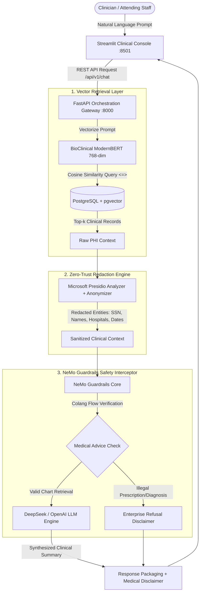

# Technical System Architecture: Zero-Trust Clinical EHR RAG

**Author:** `superezzdev`  
**System:** Enterprise Zero-Trust Clinical Decision Support Platform  
**Target Environment:** AWS EC2 Ubuntu 24.04 LTS / Docker  
**Status:** Production Ready  

---

## 1. Executive Summary & Design Principles

The **Zero-Trust Clinical EHR RAG Platform** provides clinicians and medical staff with natural language access to longitudinal patient histories extracted from **MIMIC-IV** clinical encounter transcripts. 

Medical systems handle Protected Health Information (PHI) subject to strict statutory requirements (e.g., HIPAA Title II, HITECH). Commercial Large Language Models (LLMs) cannot receive unredacted PHI or execute unconstrained medical diagnosis. This architecture enforces **Zero-Trust PHI Isolation** and **Multi-Layered Safety Guardrails** across the entire request lifecycle.

---

## 2. Core Architectural Subsystems

### 2.1 Vector Database & Semantic Storage Layer
- **Engine**: PostgreSQL 14+ with `pgvector` extension.
- **Relational Schema**: `patient_encounters` table storing 32 structured clinical attributes, including `subject_id`, `hadm_id`, `admission_type`, `drug`, `dose_val_rx`, `drg_severity`, and `description`.
- **Vector Dimension**: 768 dimensions corresponding to `NeuML/bioclinical-modernbert-base-embeddings`.
- **Search Operator**: Native cosine distance operator (`<=>`) indexed using HNSW / IVFFlat for sub-millisecond retrieval across hundreds of thousands of encounters.

### 2.2 Zero-Trust PHI Redaction Engine (Microsoft Presidio)
Before any clinical context retrieved from the database is sent to external or cloud LLM endpoints, it passes through an isolated local sanitizer:
- **Analyzer Engine**: Microsoft Presidio backed by spaCy transformer model (`en_core_web_lg`).
- **Custom Pattern Recognizers**:
  - Regex catch-all for US Social Security Numbers (`\d{3}-\d{2}-\d{4}`) bypassing checksum variances.
  - Organization deny-lists for regional hospitals and healthcare institutions (e.g., Massachusetts General Hospital, Mayo Clinic, Cleveland Clinic).
- **Target Entity Redaction**: `PERSON`, `PHONE_NUMBER`, `EMAIL_ADDRESS`, `US_SSN`, `LOCATION`, `ORGANIZATION`, `DATE_TIME`.

### 2.3 Safety & Legal Guardrails (NeMo Guardrails)
To prevent hallucinations and liability exposure:
- **Colang Dialog Rails**: Canonical forms distinguish between historical chart inquiries (e.g., *"What was the patient's last recorded dosage?"*) and actionable medical advice (e.g., *"Should I increase the dosage?"*).
- **Deterministic Refusal**: Any prompt requesting a new prescription or definitive medical diagnosis is halted immediately with an enterprise disclaimer:
  > *"I am an enterprise EHR retrieval system. For legal and compliance reasons, I cannot provide new medical diagnoses or recommend medication changes. Please consult the attending physician."*

### 2.4 Application Microservices
1. **FastAPI Gateway (`src/api/main.py`)**:
   - Asynchronous startup lifecycle preloading PyTorch models into unified shared memory.
   - Dynamic endpoints: `/api/v1/patients`, `/api/v1/clinical-query`, `/api/v1/chat`.
2. **Streamlit Clinical UI (`src/ui/app.py`)**:
   - Searchable patient file selector with 5-minute cache TTL.
   - Interactive chat timeline with disclaimer banners.

---

## 3. Threat Model & Security Posture

| Threat Vector | Mitigation Strategy | Enforcing Layer |
|---|---|---|
| **PHI Leakage to Third-Party LLM** | Microsoft Presidio scrubbing all entity classes prior to prompt generation | `src/pii_redaction/presidio_service.py` |
| **Unauthorized Prescription Advice** | NeMo Guardrails intercepting diagnostic queries before model invocation | `src/guardrails/rails.co` |
| **Database Injection / Escalation** | Parameterized SQLAlchemy statements and scoped read-only queries | `src/api/main.py` |
| **Cross-Patient Data Contamination** | Hard SQL filtering on `subject_id = :subject_id` during similarity queries | `src/api/main.py` |
| **Model Hallucination on Dosage** | Retrieval grounded solely in verified `patient_encounters` database records | PostgreSQL `pgvector` |

---

## 4. Production Deployment Topology

The entire application runs containerized on an **AWS EC2 Ubuntu 24.04 LTS** instance:
- **Docker Compose**: Orchestrates multi-process execution (`start.sh`) running FastAPI on internal port 8000 and Streamlit on public port 8501.
- **Reverse Proxy / Inbound Port**: Port 8501 exposed to trusted browser networks. Port 8000 remains strictly internal to the container network.
- **CI/CD Automation**: GitHub Actions triggered via `workflow_dispatch` executing zero-downtime rolling container rebuilds over SSH.
